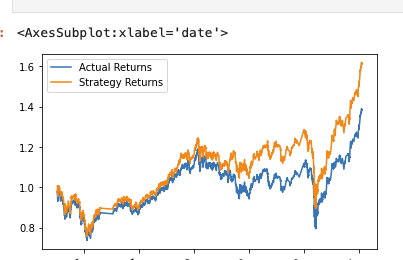
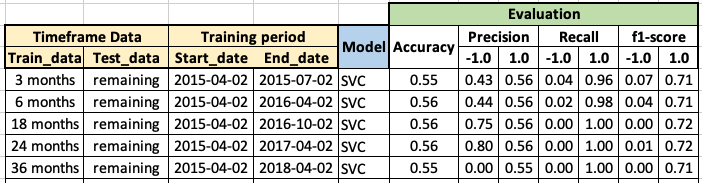
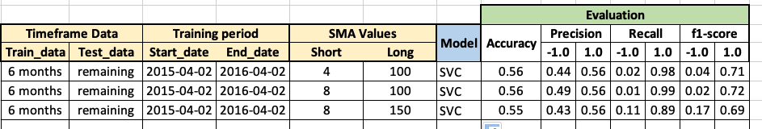
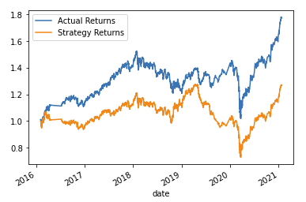
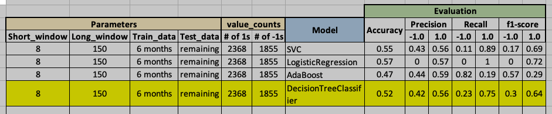

# FinTech_Algo_Trading_Unit14
Unit Project: Machine Learning Trading Bot 

## 1 Establish a Baseline Performance - Model prediction with SVC

### 1.1 Conclusion
The baseline model was established with SVC; however the results show that is not a strong model. The performance results show an accuracy of 0.55 only and low scores for the predictive negatives "-1.0s" for precision and f-1 measures. The model does a good job in predicting the positive "+1.0s" for precision, recall and f-1 scores. 

The graph as shown below for the cumulative actual returns and the strategy returns(based on prediction) shows that the strategy returns are very close and move in-sync with the actual returns for the first years until up to mid-year 2018; subsequent to that, the graph for the atrategy returns are materially higher although remain in sync with the actual returns

## 2 Tune the Baseline Trading Algorithm

### 2.1 Tune the training algorithm by adjusting the size of the training dataset

The timeframe for the dataframe starts at 2015-01-21 and ends at 2021-01-22, that is 72 months. 

For the baseline, the period had been sliced as 3 months for training data and the remamining for data test.

For tuning the training algorithm, the data has been sliced considering three options with different periods:

* Slicing Option 1: Period sliced as 6 months for training data
* Slicing Option 2: Period sliced as 18 months for training data
* Slicing Option 3: Period sliced as 24 months for training data

After running the coding lines, these are the results for the slicing options:

### Conclusion 2.1 - What impact resulted from increasing or decreasing the training window?

The change from the 3 months data for training to 6 months resulted in an overall improvement in accuracy, precision, recall and f1-score. However, when increasing beyond the 6 months there was no further improvement

### 2.2 Tune the trading algorithm by adjusting the SMA input features

### Adjusting the SMA windows for the algorithm:

### Conclusion 2.2  - What impact resulted from increasing or decreasing either or both of the SMA windows?

The results for the model improved when the short windows was increase to: short window = 8 and long window = 150

### 2.3 Choose the set of parameters that best improved the trading algorithm returns.

Based on 2.1 and 2.2 the selected parameters for the baseline trading algorithm are Training Data = 6 months, SMA short = 8 and SMA long = 150. See below the graph with actual and strategy returns for the selected model:

### 2.4 Testing of other model
The algorithm has been tested for replacing SVC alternatively with: Logistic Regression, AdaBoost and Decision Tree Classfier.

After runing the coding, the model with the best results is a Decision Tree Classification, as shown below:

